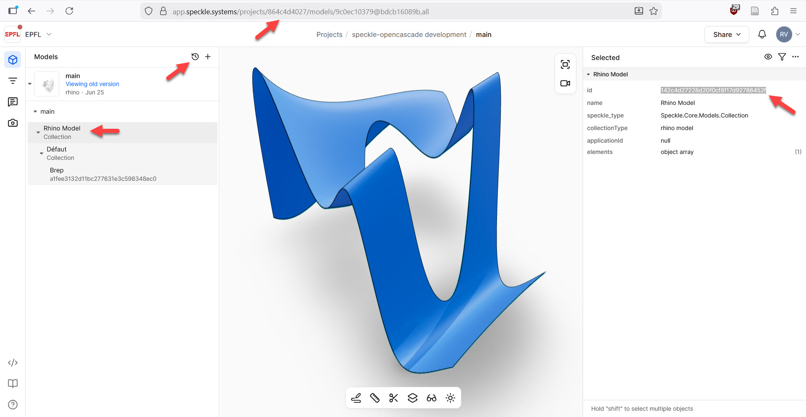
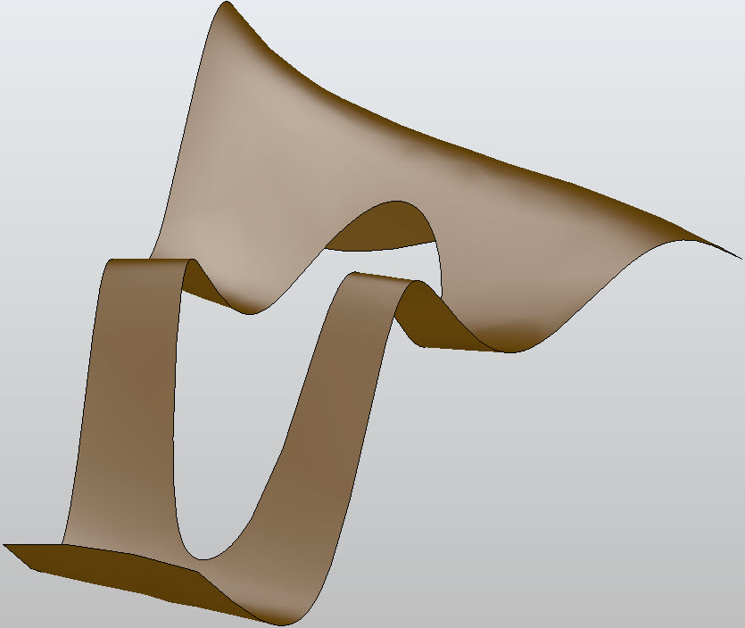

# speckle-opencascade

## About
speckle-opencascade was developed as a research project conducted at the LAPIS laboratory at EPFL ENAC IA, building on previous research and development work on interoperability for AEC carried out at the CNPA laboratory. The project was supported by the Open Research Data Program of the ETH Board.

speckle-opencascade is a prototype Speckle connector for OpenCascade.
Speckle is a collaborative platform for exchanging 3D and data for AEC, while opencascade is a geometric kernel: both are open-source.
This prototype was designed with two long-term goals in mind:
* to serve as a basis for developing connectors for any software based on OpenCascade, such as FreeCAD.
* to provide Speckle with geometric computation capabilities.

## Features
The code is written in Python, taking advantage of Python interfaces available for both Speckle and OpenCascade ecosystems from the specklepy and python-occ-core libraries (see Dependencies).
Please refer to the documentation of these two libraries for a general introduction, especially on how to connect your python code to your speckle account.

The prototype consists of two scripts:
* *occ-receive.py* allows geometries to be received from Speckle to OpenCascade. 
* *occ-send.py* allows geometries to be sent from OpenCascade to Speckle.

### Receiving from Speckle to OpenCascade
Receiving is done directly from a Speckle server. To test the development, geometries were typically modeled and sent from Rhino to Speckle. To test the script with your own speckle project, please follow the instructions of the official Speckle python doc to adapt the script to your own ids.
The speckle project is public and the geometries can be vizualised in the Speckle web viewer at this url :
https://app.speckle.systems/projects/864c4d4027/models/9c0ec10379

The occ-receive script contains a set of geometries to be received from this url.
They can be des/activated, commenting the line with # :
```
#received = operations.receive("5369930079697d28c4568dc2d99b6d97", transport) # closed curved planar face, extruded
received = operations.receive("ac4aae21998abfa560084adbe02fbd5e", transport) # curved face deformed in 3D, with curved hole, extruded  
```
The id (example: ac4aae21998abfa560084adbe02fbd5e) refers to the id of the general collection which contains the object, as shown in this screenshot:



Once the script is launched, the data is downloaded from the Speckle URL, the geometry is read according to its Speckle definition and reconstructed using the OpenCascade language, then a viewer is launched to display the result:



### Sending from OpenCascade to Speckle
The *breps* folder contains a set of geometries modeled to test the development of the occ-send script.
.brep files store geometries in the same way it is handled in OpenCascade. 
Theses geometries were modeled and exported as .brep from FreeCAD, or modeled in Rhino, exported/imported in FreeCAD via stp format and exported as .brep from FreeCAD (*from rhino* folder)

Models are included in the code and can be des/activated, commenting the line with #, as follows :
```
#breptools.Read(shape, "./breps/line.brep", builder)
breptools.Read(shape, "./breps/from rhino/faces5.brep", builder)
```

Our sending algorithm doesn't yet include the mesh representation of the object along with its geometric definition.
The mesh representation is used by Speckle viewer to display the object, therefore to get a visual result of the script you need to receive the object in the Speckle connector of a software which can rebuild it from its geometric definition, typically Rhino.

## Initial phase of development as Macro for FreeCAD
The *freecad (archive)* folder contains the scripts developed during the initial phase of the project. At this stage, the code was developed directly as a FreeCAD macro. These files are kept for reference purposes, but the code is no longer maintained.

## Note on the Speckle version
Please note that the prototype was developed using Speckle V2, therefore the conversion script is based on the default object model as defined here:
https://github.com/specklesystems/specklepy/blob/46c18bbe6b090b5153662a0b4db92cf1bf886476/src/specklepy/objects/geometry.py

## Recommended python setup (similar to ours)
1. Install Anaconda

2. From the Anaconda interface: add an environment and name it pythonocc, choosing Python 3.10
   a. Add conda-forge as a channel
   b. Install pythonocc-core from conda-forge
   c. Test it. Click on play to open a terminal and run:
   ```
   from OCC.Core.gp import *
   p = gp_Pnt(1,2,3)
   p.X()
   ```
3. Open your folder in VS Code
   a. Open the terminal
   b. To activate the environment created in Anaconda, run the following commands:
   1. ```cmd```
   2. ```[PATH]\Anaconda3\Scripts\activate.bat```
   3. ```conda activate [PATH]\AppData\Local\anaconda3\envs\pythonocc```

4. Install specklepy in this environment, running:
```pip install specklepy```

Note: Each time you reopen the project in VS Code, repeat step 3 to activate the Python environment created with Anaconda.

## Dependencies
This project uses the following third-party libraries:
- specklepy (licensed under Apache 2.0): https://github.com/specklesystems/specklepy
- pythonocc-core (licensed under the GNU Lesser General Public License version 3 as published by the Free Software Foundation): https://github.com/tpaviot/pythonocc-core

## License
This project is licensed under the Apache 2.0 License.